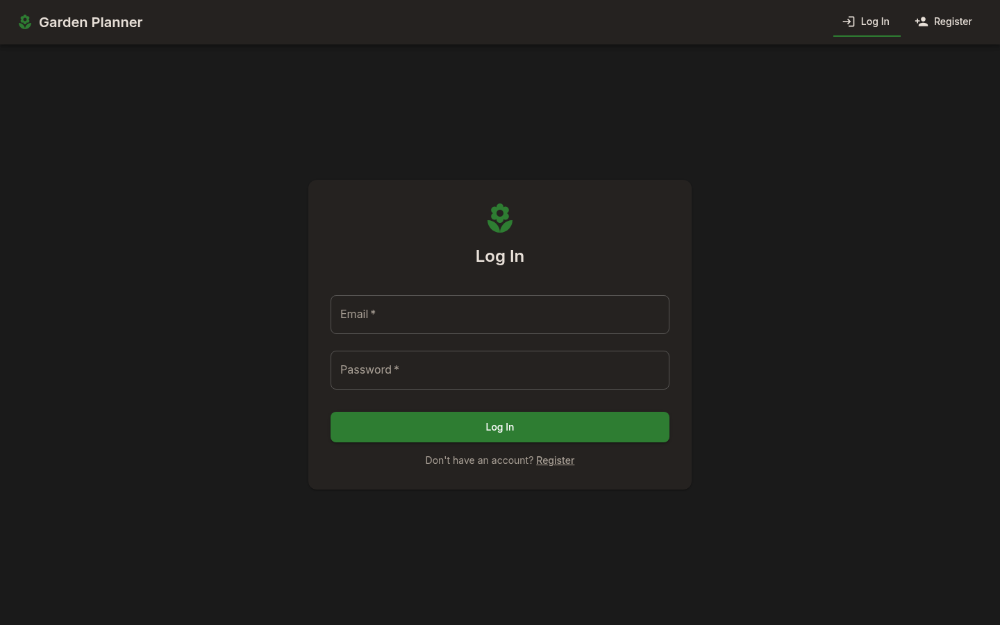
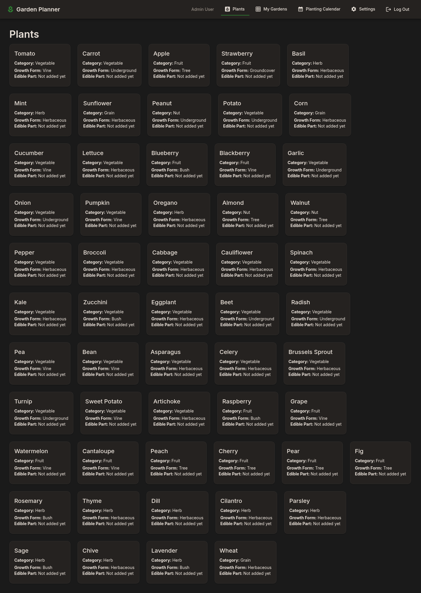
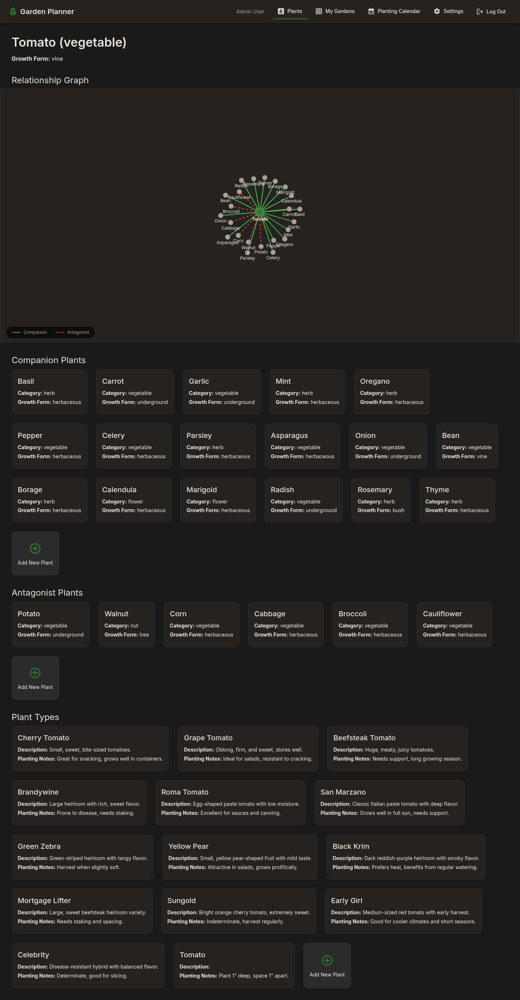
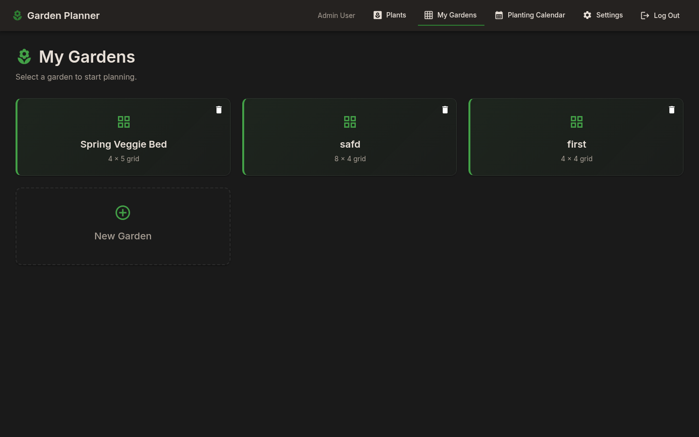
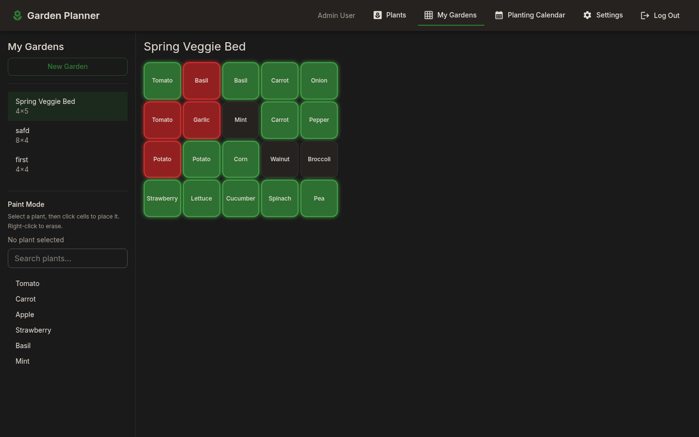
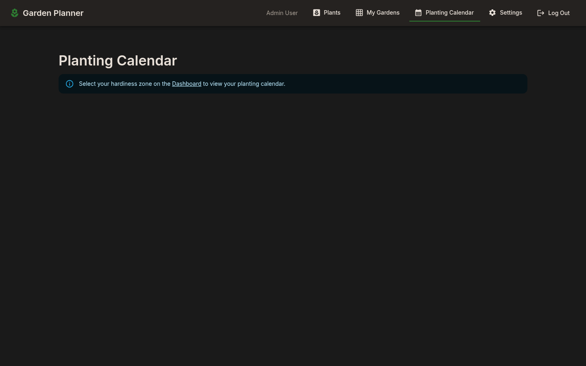
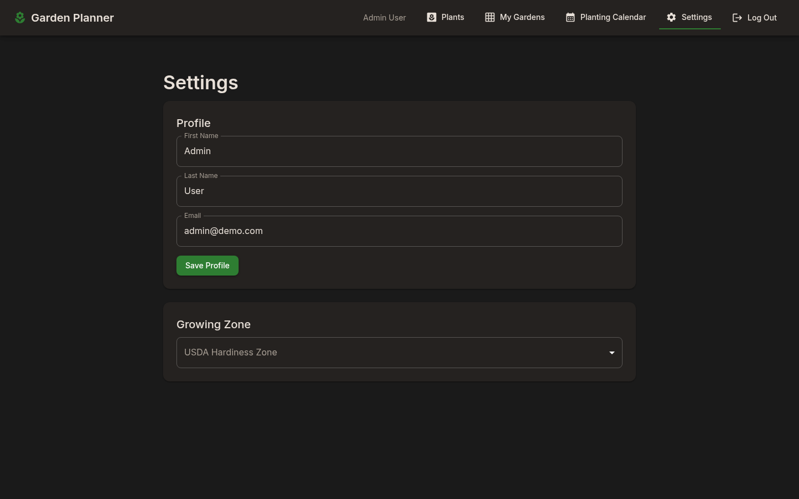
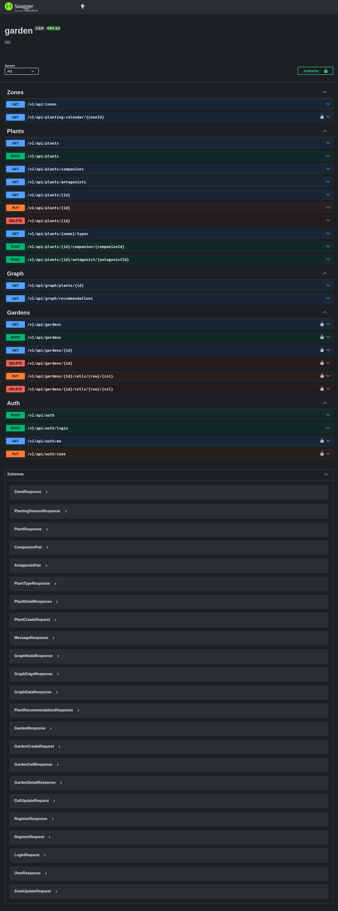

# Gardening Planner

A full-stack garden design tool for planning bed layouts, placing plants on a visual grid, and getting instant feedback on companion and antagonist plant relationships.

## What It Does

Users create grid-based garden bed layouts and place plants into individual cells. The grid provides real-time visual feedback: cells highlight green when neighboring plants are companions and red when they are antagonists. Each plant's detail page includes an interactive force-directed graph showing 1 hop of relationship data from Neo4j. The app also includes a zone-based seasonal planting calendar so users can see what to plant and when based on their USDA hardiness zone.

## Screenshots

### Login



### Plants Database



### Plant Detail with Relationship Graph



### Garden Picker



### Garden Bed Builder



### Planting Calendar



### Settings



### Swagger API Docs



## Quick Start

### Prerequisites

- Node.js 22+
- Podman (or Docker) for Neo4j

### Setup

1. Clone the repo
2. Start Neo4j: `podman compose up -d neo4j` (or `docker compose up -d neo4j`)
3. Server setup (run from `server/`):
   - `npm install`
   - `cp .env.example .env`
   - Edit `.env` and set `JWT_SECRET` (generate one with `openssl rand -base64 32`)
   - `npm run generate` — generates TSOA routes and OpenAPI spec
   - `npx tsx --experimental-sqlite scripts/seed.ts` — seeds SQLite with plants and zones
   - `npm run seed:neo4j` — seeds Neo4j with plant relationships
   - `npm run seed:users` — creates demo accounts (`admin@demo.com` / `user@demo.com`, password `demo1234`)
   - `npm run dev` — starts the API server on `http://localhost:8000`
4. UI setup in another terminal (run from `ui/`):
   - `npm install`
   - `npm run dev` — starts Vite on `http://localhost:5173`
5. Open `http://localhost:5173`, register an account (or use the demo creds below), and start building a garden.

For an all-in-one container workflow, see [Getting Started](#getting-started) below.

## Tech Stack

| Layer    | Technology                                                      |
| -------- | --------------------------------------------------------------- |
| Backend  | Node.js 22+, Express 5, TypeScript, TSOA                        |
| Auth     | JWT via `jose`, bcryptjs, HTTP-only cookies, role-based (admin) |
| API Docs | OpenAPI 3 via TSOA, Swagger UI                                  |
| Logging  | Winston, request ID tracing (`uuid`)                            |
| Frontend | React 19, Vite 6, Material UI 7, React Router 7, Axios          |
| Database | SQLite (`node:sqlite`) for users, gardens, plant CRUD           |
| Graph DB | Neo4j 5 for plant relationship traversal and recommendations    |
| Viz      | react-force-graph-2d for interactive relationship graphs        |
| Infra    | Podman Compose for container orchestration                      |
| Format   | Prettier                                                        |

## Features

- User registration and login with JWT authentication (HTTP-only cookies)
- Role-based access control: admin users can manage plant data, regular users are read-only
- Create and manage multiple named garden bed layouts
- Visual grid designer with click-to-place plant placement
- Companion plant highlighting (green) and antagonist warnings (red) on neighboring cells
- Interactive force-directed graph visualization of plant relationships (2-hop depth)
- Smart plant recommendations via Neo4j graph queries
- USDA hardiness zone selection with zone-based seasonal planting calendar
- Dual-write architecture: plant mutations sync to both SQLite and Neo4j
- ETL script to migrate existing SQLite plant data into Neo4j
- Auto-generated OpenAPI 3 spec and Swagger UI at `/v1/api/docs`
- Centralized error handling middleware with structured error responses
- Request ID tracing and Winston-based request logging

## Architecture

The server follows a strict layered architecture with a hybrid database strategy:

```
TSOA Routes --> Controllers --> Repositories --> SQLite (tabular data)
                                             --> Neo4j  (graph traversal)
```

- **Routes** are TSOA controller classes with decorators for routing, validation, and security. They auto-generate OpenAPI specs and type-safe Express routes.
- **Controllers** contain business logic and orchestrate calls across repositories. Plant write operations dual-write to both SQLite and Neo4j.
- **Repositories** own all data access. `plantRepository` and `gardenRepository` use SQLite for CRUD. `graphRepository` uses Neo4j for relationship traversal and recommendations.
- **Middleware** provides cross-cutting concerns: JWT authentication, admin authorization, request ID injection, request logging, and centralized error handling.
- **Authentication** uses two security schemes: `jwt` (any logged-in user) and `admin` (admin users only). Admin status is stored in the database and embedded in the JWT.

**Why two databases?** SQLite is ideal for tabular data (users, gardens, grid cells). Neo4j is purpose-built for traversing relationships — finding all plants within 1 hop, or plants compatible with every plant in a garden, are queries that are trivial in Cypher and painful in SQL. See [docs/neo4j-guide.md](docs/neo4j-guide.md) for a detailed comparison.

The frontend uses a centralized Axios instance (`services/api.js`) with `baseURL: "/v1"` for versioned API calls. Pages own their data via local `useState` and pass props down to presentational components. Plant relationship graphs are rendered using `react-force-graph-2d` as interactive force-directed visualizations.

## Getting Started

### Prerequisites

- **Podman** and **podman-compose** (or Docker and docker-compose)
- **Node.js 22+** if running locally (required for `node:sqlite`)

### Option 1: Run everything in containers (recommended)

```bash
# Clone the repo
git clone https://github.com/rbryce90/gardening_planner.git
cd gardening_planner

# Start all services (Neo4j, server, UI)
podman-compose up -d --build
```

That's it. The server container automatically installs dependencies, generates TSOA routes, seeds plant data, creates demo user accounts, syncs to Neo4j, and starts the app. First startup takes ~60 seconds while everything initializes. Watch progress with `podman-compose logs -f server`.

| Service       | URL                               |
| ------------- | --------------------------------- |
| UI            | http://localhost:5173             |
| Server API    | http://localhost:8000             |
| Swagger Docs  | http://localhost:8000/v1/api/docs |
| Neo4j Browser | http://localhost:7474             |

### Demo Accounts

Two accounts are created automatically on first startup:

| Email            | Password   | Role  | Access                                        |
| ---------------- | ---------- | ----- | --------------------------------------------- |
| `admin@demo.com` | `demo1234` | Admin | Full access — create, edit, delete plant data |
| `user@demo.com`  | `demo1234` | User  | Read-only plant data, manage own gardens      |

### Option 2: Run locally (Neo4j in container)

```bash
# Start only Neo4j
podman-compose up neo4j -d

# Create server/.env (see server/.env.example)
cp server/.env.example server/.env

# Install dependencies and start the server
cd server
npm install
npm run dev
# Server runs on http://localhost:8000

# In a separate terminal, start the UI
cd ui
npm install
npm run dev
# UI runs on http://localhost:5173

# Seed databases and create demo users (from server/ directory)
npx tsx --experimental-sqlite scripts/seed.ts
npm run seed:users
npm run etl:neo4j
```

### First-time setup after seeding

1. Open http://localhost:5173
2. Log in with `admin@demo.com` / `demo1234` (or `user@demo.com` for read-only access)
3. Click **Settings** in the nav bar to set your USDA hardiness zone
4. Browse **Plants** to see the plant database and relationship graphs
5. Go to **My Gardens** to create a garden layout and place plants
6. Check the **Planting Calendar** for zone-specific planting schedules

### Admin access

Plant data (create, edit, delete) is restricted to admin users. The `admin@demo.com` account has admin privileges out of the box. To grant admin to a new account, add the email to the `ADMIN_EMAILS` array in `server/controllers/authController.ts` and register with that email.

## API Endpoints

All endpoints are prefixed with `/v1`. Full OpenAPI spec available at `/v1/api/docs`.

### Auth (`/v1/api/auth`)

| Method | Path                 | Description                   | Auth |
| ------ | -------------------- | ----------------------------- | ---- |
| POST   | `/v1/api/auth`       | Register a new user           | No   |
| POST   | `/v1/api/auth/login` | Log in and receive JWT cookie | No   |
| GET    | `/v1/api/auth/me`    | Get current user profile      | JWT  |
| PUT    | `/v1/api/auth/zone`  | Update user hardiness zone    | JWT  |

### Gardens (`/v1/api/gardens`)

| Method | Path                                  | Description                | Auth |
| ------ | ------------------------------------- | -------------------------- | ---- |
| GET    | `/v1/api/gardens`                     | List user's gardens        | JWT  |
| POST   | `/v1/api/gardens`                     | Create a new garden        | JWT  |
| GET    | `/v1/api/gardens/:id`                 | Get garden with cell data  | JWT  |
| PUT    | `/v1/api/gardens/:id/cells/:row/:col` | Place a plant in a cell    | JWT  |
| DELETE | `/v1/api/gardens/:id/cells/:row/:col` | Remove a plant from a cell | JWT  |
| DELETE | `/v1/api/gardens/:id`                 | Delete a garden            | JWT  |

### Plants (`/v1/api/plants`)

| Method | Path                                          | Description                            | Auth  |
| ------ | --------------------------------------------- | -------------------------------------- | ----- |
| GET    | `/v1/api/plants`                              | List all plants                        | No    |
| GET    | `/v1/api/plants/:id`                          | Get a plant by ID                      | No    |
| GET    | `/v1/api/plants/:name/types`                  | Get plant with types and relationships | No    |
| GET    | `/v1/api/plants/companions`                   | List all companion pairs               | No    |
| GET    | `/v1/api/plants/antagonists`                  | List all antagonist pairs              | No    |
| POST   | `/v1/api/plants`                              | Create a plant                         | Admin |
| PUT    | `/v1/api/plants/:id`                          | Update a plant                         | Admin |
| DELETE | `/v1/api/plants/:id`                          | Delete a plant                         | Admin |
| POST   | `/v1/api/plants/:id/companion/:companionId`   | Add companion relationship             | Admin |
| POST   | `/v1/api/plants/:id/antagonist/:antagonistId` | Add antagonist relationship            | Admin |

### Zones & Calendar

| Method | Path                                | Description                      | Auth |
| ------ | ----------------------------------- | -------------------------------- | ---- |
| GET    | `/v1/api/zones`                     | List all USDA hardiness zones    | No   |
| GET    | `/v1/api/planting-calendar/:zoneId` | Get planting calendar for a zone | JWT  |

### Graph (`/v1/api/graph`) -- Neo4j

| Method | Path                                           | Description                                  | Auth |
| ------ | ---------------------------------------------- | -------------------------------------------- | ---- |
| GET    | `/v1/api/graph/plants/:id?hops=2`              | Get relationship graph for a plant           | No   |
| GET    | `/v1/api/graph/recommendations?plantIds=1,2,3` | Find plants compatible with all given plants | No   |

## Scripts

| Command                | Location  | Description                              |
| ---------------------- | --------- | ---------------------------------------- |
| `npm run dev`          | `server/` | Start server with hot reload (port 8000) |
| `npm run build`        | `server/` | Compile TypeScript                       |
| `npm run generate`     | `server/` | Regenerate TSOA routes and OpenAPI spec  |
| `npm run etl:neo4j`    | `server/` | Sync SQLite plant data to Neo4j          |
| `npm run seed:neo4j`   | `server/` | Seed Neo4j from seed-data.json           |
| `npm run seed:users`   | `server/` | Create demo user accounts                |
| `npm run dev`          | `ui/`     | Start Vite dev server (port 5173)        |
| `npm run build`        | `ui/`     | Production build                         |
| `npm run format`       | root      | Format all source files with Prettier    |
| `npm run format:check` | root      | Check formatting without writing         |

## Project Structure

```
gardening_planner/
  podman-compose.yml           # Container orchestration (Neo4j, server, UI)
  .prettierrc.json             # Prettier config
  docs/
    neo4j-guide.md             # How Neo4j and Cypher work in this project
  server/
    index.ts                   # Express app entry point, Swagger UI mount
    tsoa.json                  # TSOA config (routes, spec, security schemes)
    authentication.ts          # TSOA auth handler (jwt + admin schemes)
    routes/                    # TSOA controller classes (one per resource)
    controllers/               # Business logic (dual-write to SQLite + Neo4j)
    repositories/              # Data access (plantRepository → SQLite, graphRepository → Neo4j)
    databases/                 # SQLite + Neo4j connection management
    middleware/                # errorHandler, requestId, requestLogger
    types/                     # TypeScript interfaces for TSOA + domain types
    utils/                     # Winston logger, password hashing
    generated/                 # Auto-generated TSOA routes + swagger.json
    scripts/
      seed.ts                  # SQLite seed script
      seedNeo4j.ts             # Neo4j seed from JSON
      etlToNeo4j.ts            # ETL: SQLite → Neo4j sync
      seed-data.json           # Plant, zone, and relationship seed data
  ui/
    src/
      App.jsx                  # Root component, routing, MUI dark theme
      pages/                   # Dashboard, Garden, Calendar, Plants, PlantType, Login, Register
      components/              # GardenGrid, PlantCard, PlantGraph, PlantPickerDialog, Header
      services/                # api.js (Axios base), authService, gardenService, zoneService, graphService
      models/                  # Shared TypeScript types
      utils/                   # Helper functions
```

## License

MIT — see [LICENSE](LICENSE).
